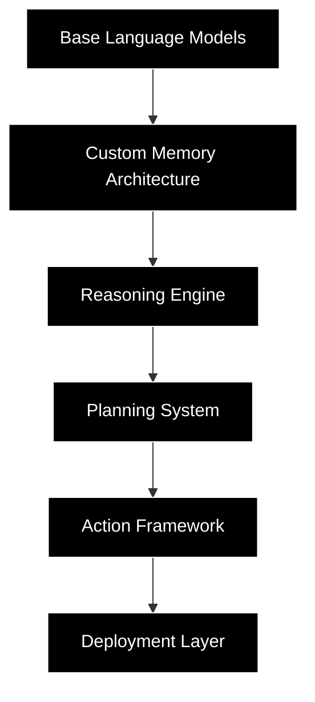

<div align="center">
  
```ascii
█▀█ █   █▀█ █▀▀ █▀▀ █▄░█ ▀█▀
█▀█ █   █▀█ █▄█ ██▄ █░▀█ ░█░
```

# AI AGENT FROM SCRATCH

<h3>
  <code>>> Building autonomous AI agents from first principles.</code>
</h3>

<br/>

[](https://discord.gg/aiagentfromscratch)
[](https://twitter.com/aiagentfromscratch)
[](https://github.com/aiagentfromscratch)

<br/>

---

<br/>

<table>
<tr>
<td width="50%">

### Our Vision

We're building the foundational layers for truly autonomous AI agents. Not wrappers, not abstractions – but fundamental architectures that push the boundaries of what's possible.

</td>
<td width="50%">

### Our Approach

From memory systems to reasoning engines, we build every component from scratch, ensuring deep understanding and maximum control over agent behavior.

</td>
</tr>
</table>

<br/>

<h2>⚡ Core Technologies</h2>

<table>
<tr>
<td align="center">
<!--  -->
<h3>Agent Core</h3>
Our flagship framework for building autonomous agents
</td>
<td align="center">
<!--  -->
<h3>Memory Systems</h3>
Advanced contextual and episodic memory
</td>
<td align="center">
<!--  -->
<h3>Reasoning Engine</h3>
Multi-step planning and decision making
</td>
</tr>
</table>

<br/>

<h2>🔮 Technical Architecture</h2>



<br/>

<h2>🤝 Join the Revolution</h2>

```python
# The future of AI agents starts here
from aiagent import AgentCore

agent = AgentCore.create(
    architecture="custom",
    memory_system="episodic",
    reasoning_engine="advanced"
)

# Join us in building the future
```

<br/>

<h2>📚 Resources</h2>

<table>
<tr>
<td width="25%" align="center">
<h3>Documentation</h3>
<a href="https://docs.aiagentfromscratch.com">Read Docs →</a>
</td>
<td width="25%" align="center">
<h3>Examples</h3>
<a href="https://github.com/aiagentfromscratch/examples">View Code →</a>
</td>
<td width="25%" align="center">
<h3>Research</h3>
<a href="https://research.aiagentfromscratch.com">Read Papers →</a>
</td>
<td width="25%" align="center">
<h3>Community</h3>
<a href="https://discord.gg/aiagentfromscratch">Join Us →</a>
</td>
</tr>
</table>


<br/>

<sub>© 2025 AI Agent from Scratch • MIT License</sub>

</div>
